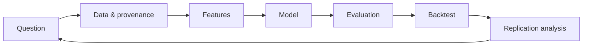

# CrSunshine

**Finance × Data × AI × Engineering**

I am a finance-domain professional building data-driven and AI-native financial systems. My background spans Chinese CPA and U.S. CPA qualifications, experience at PwC and EY, service as an executive director of a listed company, and entrepreneurship and company building. My current work connects financial-domain knowledge with empirical research, reproducible data pipelines, machine learning, and forward-deployed problem solving.

## Current Focus

- Reproducible quantitative research and financial data engineering
- Machine-learning systems for forecasting, ranking, and decision support
- AI-native financial workflows with explicit evaluation and controls
- Forward-deployed engineering: translating real operating problems into working systems

## Featured Work

**[Qlib Alpha158 Replication](https://github.com/CrSunshine/qlib-alpha158-replication)** — A reproducible study of Microsoft Qlib's CSI300 Alpha158 + LightGBM benchmark, including data provenance, signal evaluation, portfolio backtesting, and replication-error analysis.

## Research Interests

Financial machine learning; factor research; time-series and cross-sectional forecasting; model evaluation under distribution shift; dataset provenance; financial AI benchmarks; reproducible empirical research; human-in-the-loop AI systems.

## Engineering / Data Capabilities

- Financial-data ingestion, validation, transformation, and lineage
- Python research pipelines, configuration-driven experiments, and automated tests
- Feature construction, LightGBM modeling, signal evaluation, and backtesting
- Reproducible environments, experiment metadata, CI, and research dashboards

## Research Workflow

## Selected Projects

- **Qlib Alpha158 Replication** — flagship replication study
- **Open Finance AIP** — roadmap for an auditable financial AI platform
- **Financial AI Benchmark** — roadmap for task-based model evaluation
- **Finance Replication Lab** — roadmap for systematic replication studies
- **Financial Forecasting Lab** — roadmap for forecasting experiments
- **Finance Research** — roadmap for research notes and datasets

## Contact

- GitHub: [@CrSunshine](https://github.com/CrSunshine)
